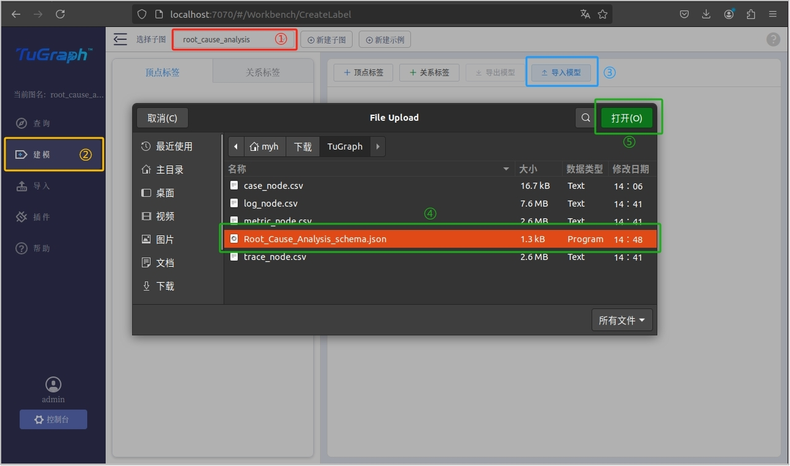
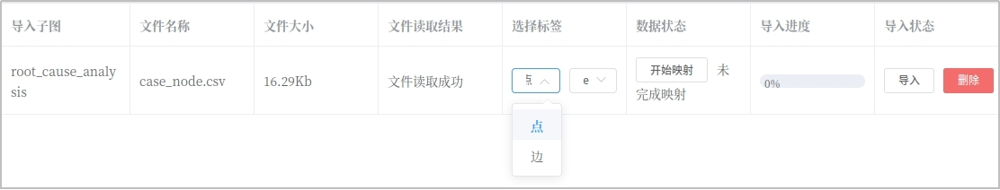

**基于微服务监测数据的异常分析建模及应用**

1. **文档介绍**

本文档详细介绍了根因分析模型的研究背景、模型构建、数据导入和查询任务，读者可根据此文档建立对基于TuGraph的根因分析模型的认识，并根据对应文件尝试构建该模型。

2. **背景介绍**

随着微服务应用规模的不断增长，微服务系统异常类型越发繁多，保障大规模微服务系统的稳定性变得至关重要。一旦某个服务实例出现故障，异常状态可能会迅速在相邻的服务实例之间扩散，从而对整个微服务系统的稳定性造成影响。因此，对系统异常和用户反馈的有效检测与定位，对于开发人员快速识别和解决问题，缩短系统故障时间，以及增强系统整体稳定性至关重要。

3. **模型介绍**

微服务系统的监测数据主要包括日志（log）、踪迹（trace）和度量（metric）。因此，每个事务包含以上三种监测类型的数据。日志：以半结构化的文本形式记录服务流程和交互信息，包括关键时间点、流程详情和阶段结果。踪迹：以树状结构详细记录事务调用的序列、状态和结果，确保操作的可追溯性和完整性。度量数据：以时间序列形式记录系统性能和硬件状态的关键指标，如CPU、磁盘和内存使用情况。

模型包含了每个事务所对应的异常根因、该事务日志记录的特征向量、该事务踪迹记录的特征向量、该事务度量记录的特征向量，分别对应的不同的节点。

模型结构如图3-1所示，模型节点标签说明如表1所示。

图3-1  根因分析模型结构

表1

| **标签**       | **类型** | **说明**                        |
| ------------------------------------------- | ------------------------------------- | ------------------------------------------------------------ |
| case_node      | 节点     | 表示某一事务                    |
| trace_node     | 节点     | 表示某一事务的踪迹监测数据      |
| log_node       | 节点     | 表示某一事务的日志监测数据      |
| metric_node    | 节点     | 表示某一事务的度量监测数据      |
| id             | 实体     | 作为主键在TuGraph中标识一个事务 |
| case_id        | 实体     | 微服务中唯一表示一个事务的统一标识符 |
| trace_feature  | 实体     | 表示该事务所有踪迹数据的特征向量 |
| log_feature    | 实体     | 表示该事务所有日志数据的特征向量 |
| metric_feature | 实体     | 表示该事务所有度量数据的特征向量 |
| trace          | 关系     | 表示连接当前事务和对应踪迹节点  |
| log            | 关系     | 表示连接当前事务和对应日志节点  |
| metric         | 关系     | 表示连接当前事务和对应度量节点  |

4. **导入模型**

在安装好TuGraph并运行后，可以通过浏览器访问模型导入界面微服务根因分析模型 [http://localhost:7070/#/Workbench/CreateLabel](http://localhost:7070/#/Workbench/CreateLabel )。模型结构信息存放于文件Root_Cause_Analysis_schema.json。

（1）建立子图，点击最上方导航栏中的“新建子图”，然后填写子图信息，最后点击“创建”，完成根因分析子图创建，具体步骤如图4-1所示。

图4-1  新建子图

（2）导入模型。首先切换到刚才新建的根因分析子图，接着点击左侧导航栏中的“建模”，接着选择右上方的“导入模型”，选择文件夹中的Root_Cause_Analysis_schema.json，最后点击“导入”完成模型导入，具体步骤如图4-2所示。

图4-2  导入模型

导入成功后显示如图4-3所示，包含四个顶点标签和三个关系标签。

图4-3  导入结果

5. **导入数据**

依据所有节点和关系，依次导入监测数据。首先点击左侧导航栏的“导入”，接着点击屏幕中央的“选择文件”，具体步骤如图5-1所示。

图5-1  导入数据

（1）导入case_node节点数据，对应的文件为case_node.csv。首先在弹出的文件夹中选择case_node.csv，接着点击右上角“打开”，如图5-2所示。接着在选择标签处，分别选择“点”和“case_noce”，分别如图5-3和图5-4所示。接着映射数据状态，选择从第2行开始导入，每一列对应文件标签和节点标签一一对应，最后点击“映射”，如图5-5所示。最后，点击“导入”，待导入进入变为100%后即为导入成功如图5-6所示。

图5-2  导入case_node节点数据

图5-3  导入case_node节点数据

图5-4  导入case_node节点数据

图5-5  导入case_node节点数据

图5-6  导入case_node节点数据

（2）导入trace_node、log_node和metric_node节点数据，对应的文件分别为trace_node.csv、log_node.csv和metric_node.csv。分别重复上述导入case_node节点数据的操作，分别导入trace_node、log_node和metric_node节点数据，标签选择“点”和对应的节点名称，均从第二行开始映射，每一列对应文件标签和节点标签一一对应。导入成功后如图5-7所示。

图5-7  导入trace_node、log_node和metric_node节点数据

（3）导入边。分别为每个事务导入log、trace和metric的边信息。由于case_node的主键为id，trace_node、log_node和metric_node的主键为case_id，因此，可以使用case_node.csv完成边信息导入。选择文件时依旧选择case_node.csv，标签选择“边”和对应的边名称，如图5-8和图5-9所示。接着映射数据状态，选择从第2行开始导入，起点选择case_node，终点选择对应的节点，如图5-10所示。然后点击映射，并完成导入，如图5-11所示。接着重复上述操作，完成对剩余边数据的导入，最后结果如图5-12所示。

图5-8  导入边数据

图5-9  导入边数据

图5-10  导入边数据

图5-11  导入边数据

图5-12  导入边数据

6. **查询实例**

按照上述步骤完成模型导入和数据导入后，可使用 MATCH (n) RETURN n LIMIT 10测试导入结果，可以看到页面展示了是个case_node，对当个case_node点击“一级展开”可以看到对应的trace_node、log_node和metric_node，如图6-1所示。读者可在构建完成后尝试完成下面几个任务。

图6-1  测试结果

（1）查询任务一

查询case_id为“10103213cb147bca”的trace节点。结果如图6-2所示。正确查询语句如下：

MATCH (n)-[e:trace]-(m) where n.case_id='10103213cb147bca' RETURN n

图6-2  查询结果

（2）查询任务二

查询case_id为“10103213cb147bca”的所有节点。查询结果如图6-3所示，正确查询语句如下：

MATCH (n)-[e]-(m) where n.case_id='10103213cb147bca' RETURN n , m

图6-3  查询结果

（3）查询任务三

查询所有正常事务的case_node、trace_node、log_node和metric_node节点。查询结果如图6-4所示，正确查询语句如下：

MATCH (n)-[e]-(m) where n.root_cause='Normal' RETURN n,m

图6-4  查询结果

（4）查询任务四

查询所有根因为文件异常的事务的trace_node。查询结果如图6-5所示，正确查询语句如下：

MATCH (n)-[e:trace]-(m) where n.root_cause='File Missing' RETURN m

图6-5  查询结果